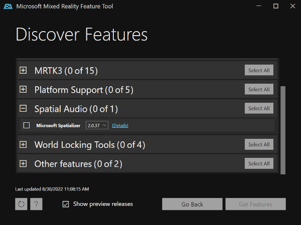
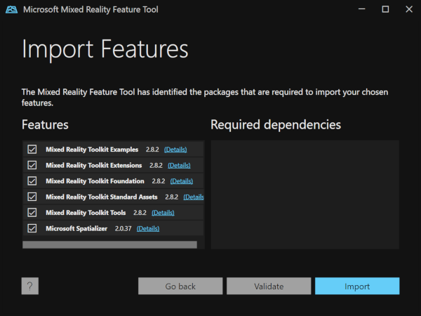
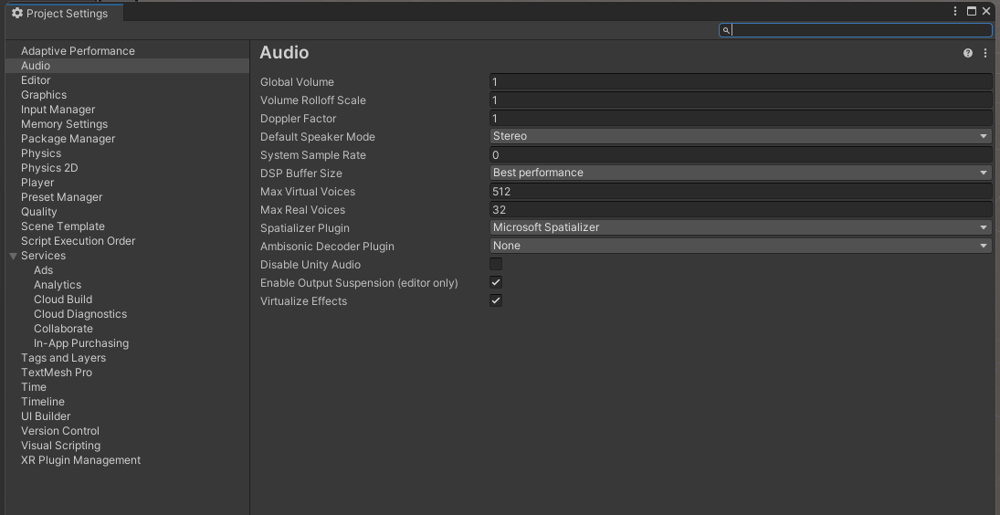
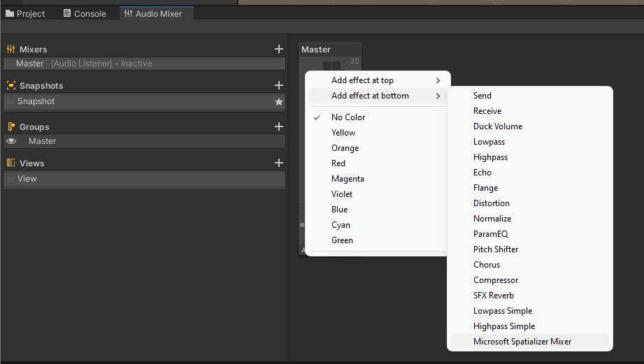
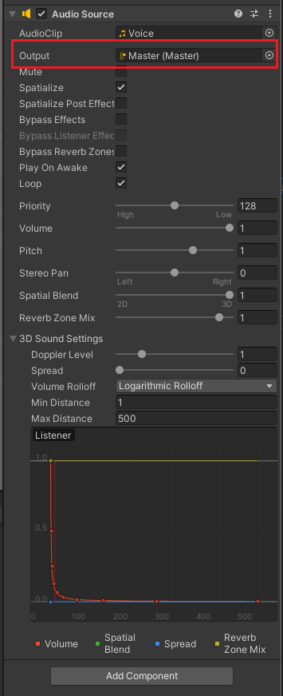

# How to add the plugin to Unity projects

## 1. Add the spatializer package via the Mixed Reality Feature Tool
- Download the Mixed Reality Feature Tool from https://aka.ms/mrfeaturetool.
- Select the `Microsoft Spatializer` component from the `Spatial Audio` group and integrate the plugin into your project using the `Get Features` button.

    

- If you are using the Sample project in the repo, you'll need to import the MRTK packages listed below, in addition to the spatializer plugin:

    

The plugin package can also be downloaded from GitHub releases and imported into the project using `Assets > Import Package > Custom Package` menu.  

## 2. Configure the project to use Microsoft Spatializer
- Open the project settings using `Edit > Project Settings`
- In the `Audio` tab, select `Microsoft Spatializer` in the `Spatializer Settings` dropdown. No other changes are necessary.

    

## 3. Add the Microsoft Spatializer Mixer to the project
`Microsoft Spatializer Mixer` effect is necessary to process all the spatialized audio objects in a scene.
- Add an audio mixer to the project
  - In the `Project` pane, right-click on the `Assets` folder, then `Create > Audio Mixer`
  - Give the mixer a name, e.g. `Master` 
  - Open the mixer and right-click, then select `Add effect at bottom > Microsoft Spatializer Mixer`

    

## 4. Spatialize audio objects
- Setup spatialized audio objects as usual, making sure to route the `Output` to the `Master` audio mixer setup above.

    

